<p align="center">  </p>

```console
$ cat about.txt
Магистрант НИЯУ МИФИ, физик по образованию.
Анализирую данные эксперимента и симуляций на Python.
Ищу закономерности, аномалии и их причины.
```

```console
$ cat profile.py
```
<svg xmlns="http://www.w3.org/2000/svg" width="573" height="154" viewBox="0 0 573 154">
<style>text{font-family:"JetBrains Mono","SFMono-Regular",Consolas,"Liberation Mono",Menlo,monospace;font-size:22px;font-weight:600;fill:#3FB950}
.r0{transform-box:fill-box;transform-origin:0 0;transform:scaleX(1);animation:s0 0.56s steps(8,end) 0.40s backwards}@keyframes s0{from{transform:scaleX(0)}to{transform:scaleX(1)}}
.c0{opacity:0;animation:m0 0.56s steps(8,end) 0.40s both,v0 0.56s step-end 0.40s}@keyframes m0{to{transform:translateX(104px)}}@keyframes v0{from{opacity:1}to{opacity:1}}
.r1{transform-box:fill-box;transform-origin:0 0;transform:scaleX(1);animation:s1 2.87s steps(41,end) 1.36s backwards}@keyframes s1{from{transform:scaleX(0)}to{transform:scaleX(1)}}
.c1{opacity:0;animation:m1 2.87s steps(41,end) 1.36s both,v1 2.87s step-end 1.36s}@keyframes m1{to{transform:translateX(533px)}}@keyframes v1{from{opacity:1}to{opacity:1}}
.r2{transform-box:fill-box;transform-origin:0 0;transform:scaleX(1);animation:s2 0.56s steps(8,end) 4.63s backwards}@keyframes s2{from{transform:scaleX(0)}to{transform:scaleX(1)}}
.c2{opacity:0;animation:m2 0.56s steps(8,end) 4.63s both,v2 0.56s step-end 4.63s}@keyframes m2{to{transform:translateX(104px)}}@keyframes v2{from{opacity:1}to{opacity:1}}
.r3{transform-box:fill-box;transform-origin:0 0;transform:scaleX(1);animation:s3 0.98s steps(14,end) 5.59s backwards}@keyframes s3{from{transform:scaleX(0)}to{transform:scaleX(1)}}
.c3{opacity:0;animation:m3 0.98s steps(14,end) 5.59s both,b 1s step-end 5.59s infinite}@keyframes m3{to{transform:translateX(182px)}}
@keyframes b{0%,49%{opacity:1}50%,100%{opacity:0}}</style>
<clipPath id="k0"><rect class="r0" x="20" y="14" width="104" height="32"/></clipPath><text x="20" y="36" textLength="104" lengthAdjust="spacing" clip-path="url(#k0)">$ whoami</text><rect class="c0" x="20" y="17" width="10" height="22" fill="#3FB950"/>
<clipPath id="k1"><rect class="r1" x="20" y="46" width="533" height="32"/></clipPath><text x="20" y="68" textLength="533" lengthAdjust="spacing" clip-path="url(#k1)">mikhail_stepanov # стажёр-аналитик данных</text><rect class="c1" x="20" y="49" width="10" height="22" fill="#3FB950"/>
<clipPath id="k2"><rect class="r2" x="20" y="78" width="104" height="32"/></clipPath><text x="20" y="100" textLength="104" lengthAdjust="spacing" clip-path="url(#k2)">$ status</text><rect class="c2" x="20" y="81" width="10" height="22" fill="#3FB950"/>
<clipPath id="k3"><rect class="r3" x="20" y="110" width="182" height="32"/></clipPath><text x="20" y="132" textLength="182" lengthAdjust="spacing" clip-path="url(#k3)">ищу стажировку</text><rect class="c3" x="20" y="113" width="10" height="22" fill="#3FB950"/>
</svg>
```python
class Mikhail:
    role      = "Стажёр — аналитик данных"
    education = "НИЯУ МИФИ, магистратура"
    stack     = ["Python", "SQL", "pandas", "NumPy", "SciPy", "Matplotlib", "Seaborn", "MS Office"]
    focus     = ["анализ данных", "статистика", "A/B-тесты"]
    status    = "ищу стажировку"
```

```console
$ ls ~/skills
python/  sql/  pandas/  numpy/  scipy/  matplotlib/   jupyter/  git/  linux/  seaborn/  ms office/
```

<p align="center">
  
</p>

```console
$ contact --me
```

<p align="center">
  <a href="https://t.me/Mishast0315"><picture><source media="(prefers-color-scheme: dark)" srcset="https://img.shields.io/badge/Telegram-%40Mishast0315-238636?style=for-the-badge&labelColor=21262D&logoColor=white&logo=telegram"></picture></a>
  <a href="mailto:mk-stepanov@mail.ru"><picture><source media="(prefers-color-scheme: dark)" srcset="https://img.shields.io/badge/Email-mk--stepanov%40mail.ru-238636?style=for-the-badge&labelColor=21262D&logoColor=white&logo=gmail"></picture></a>
</p>
